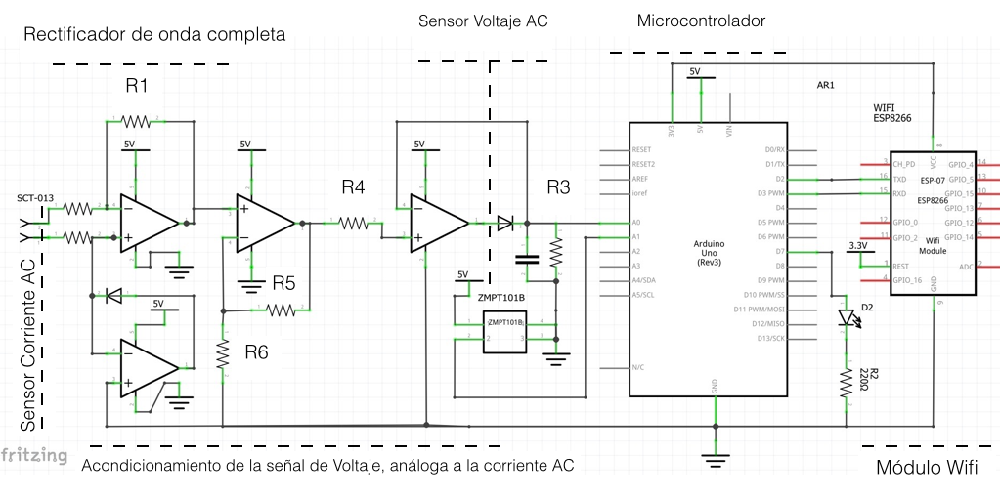

# EPS-Jetson-Nano
Energy Prediction System with a neural network (CNN-LSTM) in a Jetson Nano. 

In this proyect we'll going to build an active power meter with an Arduino Uno. The data will be send to the Jetson-Nano with the Python script "arduino_serial.py" to stablish the comunication between the Jetson and the Arduino. 
The second script, "neural_training.py" is to start the training for the hybrid neural network and visualize the data. The convolutional layers will extract the spatial features and the LSTM layers the temporal ones.

# Materials:

* 1 - Jetson-Nano Developer Kit from Nvidia
* 1 - HDMI cable
* 1 - LCD screen
* 1 - AC/DC Charger 5v, 4 Amp
* 1 - Arduino uno
* 1 - ZMPT101.B Voltage Sensor
* 1 - SCT-030 Current Transformer Sensor
* 1 - Operational Amplifier

# The elecronic circuit for the power meter with the Arduino

¡
¡

# Install the libraries
sudo apt-get install numpy pandas pyserial schedule keras

# Change permition of the serial port
'''sudo chmode 772 /dev/ttyAMC0/''' 

# Upload the code
Connect your Arduino to the Jetson Nano and upload the file: "CONSUME_SERIAL.ino"
Remember you need to install the libraries:
* Filters.h
* avr/wdt.h
* Wire.h

# Run the code
cd /EPS-Jetson-Nano/ 
python3 arduino_serial.py

In other terminal run:
cd /EPS-Jetson-Nano/ 
python3 neural_training.py

Wait to acquire enough data 

# Final steps:
Use "visualize.py" to visualiaze your predictions of the .h5 file saved after the deep learning training.
