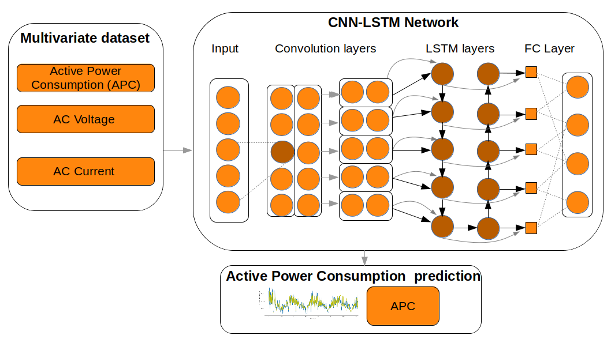
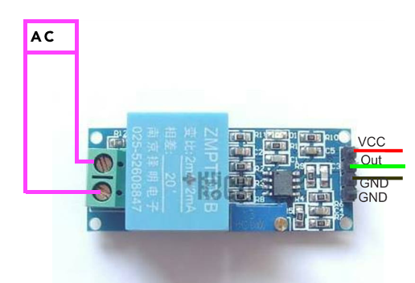
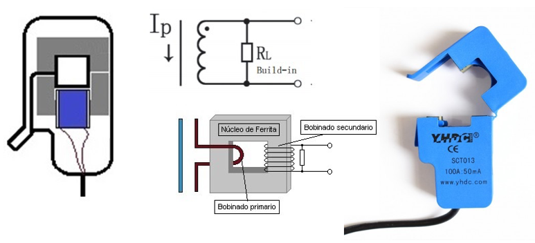
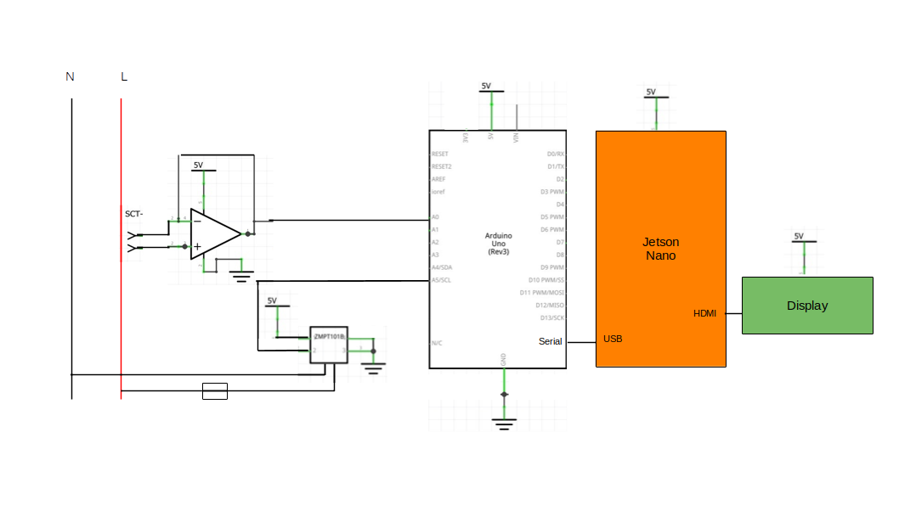
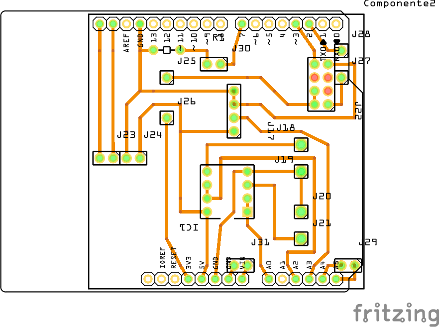
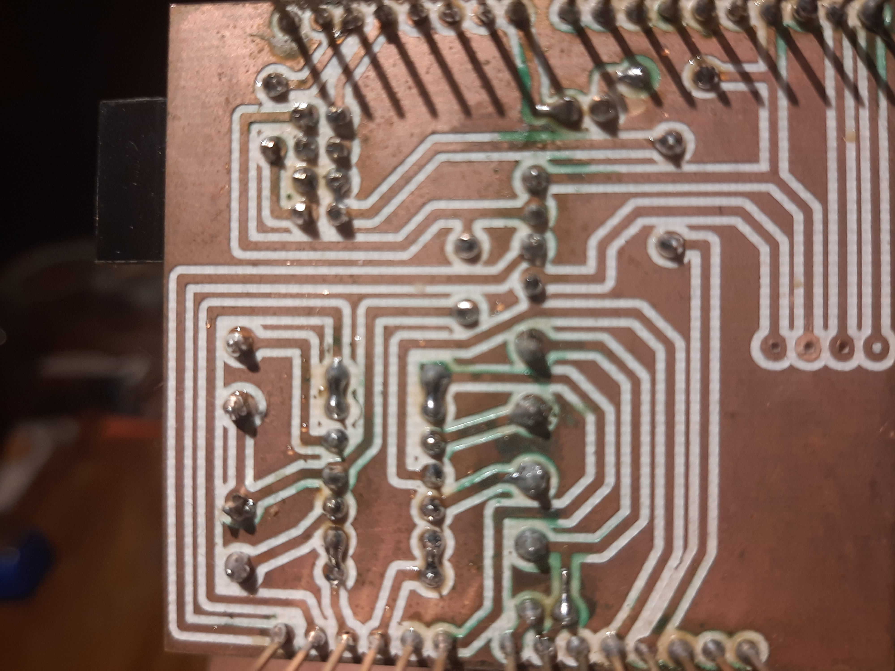
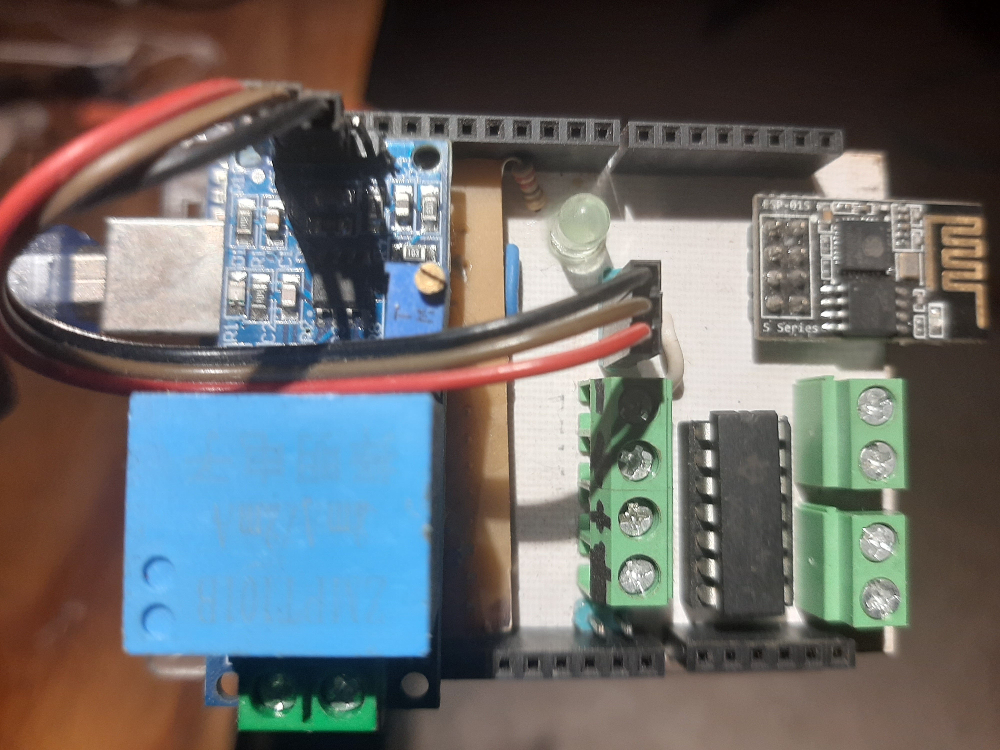
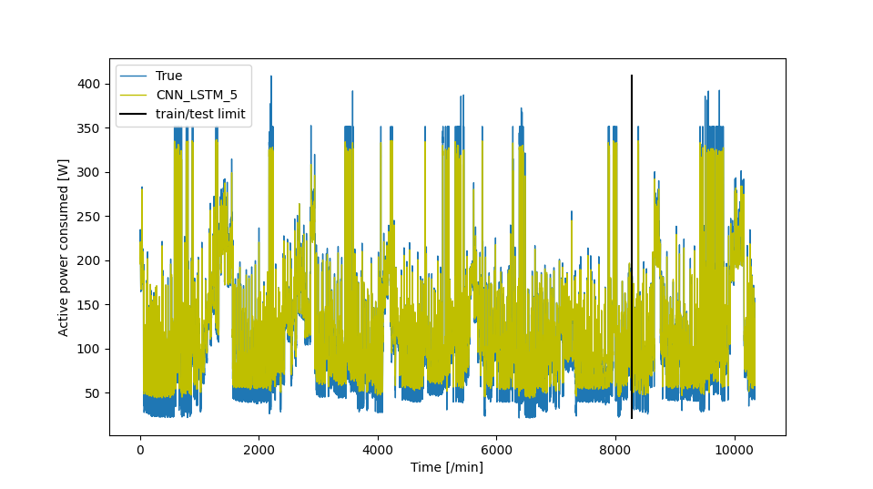
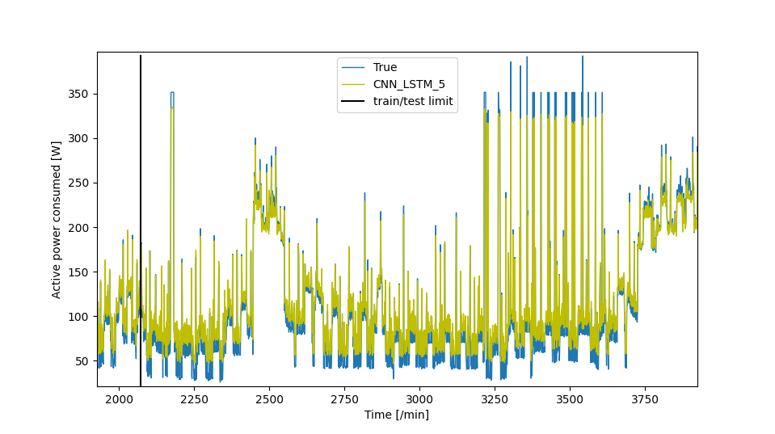

# EPS-Jetson-Nano
Energy Prediction System with a neural network (CNN-LSTM) in a Jetson Nano. 

In this project we are going to build an active power meter with an Arduino Uno. The data will be sent to the Jetson-Nano with the Python script "arduino_serial.py" to establish the communication between the Jetson and the Arduino. 
The second script, "neural_training.py" is to start the training for the hybrid neural network and visualize the data. 

# The neural network
CNN-LSTM neural network, which combines convolutional neural network (CNN) and long short-term memory (LSTM), can extract complex features of energy consumption. The CNN layer can extract the features between several variables affecting energy consumption, and the LSTM layer is appropriate for modeling temporal information of irregular trends in time series components. 

The CNN-LSTM method for predicting electric energy consumption consists of a series of connection of CNN and LSTM. CNN-LSTM can extract complex features among multiple sensor variables collected for electric energy demand forecasting and can store complex irregular trends. First, the upper layer of CNN-LSTM consists of a series of convolutional layers. The CNN layer can receive various variables that affect electric energy consumption such as voltage, intensity, and sub
metering. So, CNN consists of an input layer that accepts sensor variables as inputs, an output layer that extracts features to LSTMs, and several hidden layers.

CNN-LSTM structure:


# Materials:

* 1 - Jetson-Nano Developer Kit from Nvidia
* 1 - HDMI cable
* 1 - 7 inch LCD screen
* 1 - AC/DC Charger 5v, 4 Amp
* 1 - Arduino uno
* 1 - Serial to USB cable
* 1 - ZMPT101.B Voltage Sensor
* 1 - SCT-030 Current Transformer Sensor
* 1 - Operational Amplifier LM32
* 1 - 500mA Fuse

# The elecronic circuit for the power meter with the Arduino

* Voltage Sensor:


* Current Sensor:


* General Circuit: 


* PCB: 


Download pcb.fzz to get the fritzzing file for pcb production.

* Power Meter: 


NOTE: Be carefull when you connect the sensors, the author don't take any responsability for any damage.
# Install Tensorflow in the Jetson Nano
```
sudo apt-get install libhdf5-serial-dev hdf5-tools libhdf5-dev zlib1g-dev zip libjpeg8-dev liblapack-dev libblas-dev gfortran
sudo apt-get install python3-pip
sudo pip3 install -U pip
sudo pip3 install -U pip testresources setuptools numpy==1.16.1 future==0.17.1 mock==3.0.5 h5py==2.9.0 keras_preprocessing==1.0.5 keras_applications==1.0.8 gast==0.2.2 futures protobuf pybind11

# TF-2.x
sudo pip3 install --pre --extra-index-url https://developer.download.nvidia.com/compute/redist/jp/v44 tensorflow==2.3.0+nv20.9
```
# Install more libraries
```
sudo pip3 install numpy pandas pyserial schedule matplotlib os datetime scipy sklearn keras
```
# Change permission of the serial port directory
```
sudo chmod 772 /dev/ttyAMC0/ 
```
# Upload the code
Connect your Arduino to the Jetson Nano and upload the file: "CONSUME_SERIAL.ino"
Remember you need to install the libraries:
* Filters.h
* avr/wdt.h
* Wire.h

# Run the code
```
cd /EPS-Jetson-Nano/ 
python3 arduino_serial.py
```
In other terminal run:
```
cd /EPS-Jetson-Nano/ 
export LD_PRELOAD=/usr/lib/aarch64-linux-gnu/libgomp.so.1
python3 neural_training.py
```
Wait to acquire enough data, the training will start automatically.  

# Final steps
Use "visualize.py" to visualiaze your predictions of the .h5 file saved after the deep learning training.


